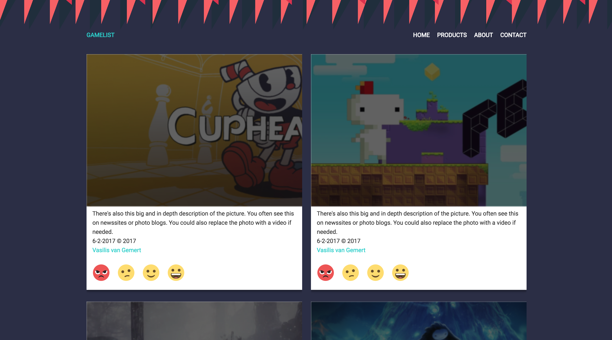

# CSSTR Process
`This` document is made for my progress in CSSTR class.
It will contain my scedule and the progress I've made in the couple of weeks for this class.
We had to make sketchnotes, and assignment that are contained in the webpage.

  
[De Opdracht](https://senmetsu.github.io/cssttr/)

## Assessments
* Make a page for Marijn.
* Make sketchnotes from the articles you had to read.
* Fill the webpage with components.
* The webpage should be fixed by using no classes.

## Scedule
| Week 1        | Week 2|  Week 3  |
| ------------- |:-------------:| -----:|
| Research    | Code | Code |
| Design    | Research |
| Code | Code    |

## Design 

## Week 1.
Done some research for accesibility, and made a design for the assignment.

* 5.25 
* 6.33 
* 7.36 
* 7.38
* 7.40

## Week 2.
In week 2 I focussed on the components of the web page. I also brought some CSS in place.

* Loading spinner — 8.43
* Transitions on :hovers & :focus— 8.42
* Cursor — 6.29
* Extending the clickable area — 6.30
* Custom checkboxes — 6.31
* (Pseudo)random background — 2.7

## Week 3.
In week 3 was looking for some nice UX animations. With the animations I want to help the user on the page.

## What did I learn?
There is alot more to learn from CSS. I'm talking about the different pseudo classes and how to target your HTML elements.
Its also alot of fun to play with animations to see where the limits are.

### Resources
* [Gridgarden](http://cssgridgarden.com/)
* [Debugging keyframes](https://css-tricks.com/debugging-css-keyframe-animations/)
* [Animation States](https://css-tricks.com/css-animation-tricks/)
* [Form Validation CSS](https://css-tricks.com/form-validation-ux-html-css/)
* [CSS Parenting](https://css-tricks.com/parent-selectors-in-css/)
* [Transform](https://css-tricks.com/almanac/properties/t/transform/)
* [Focus-within](https://developer.mozilla.org/en-US/docs/Web/CSS/:focus-within)

## References:
Hierin zitten argumenten voor aanpassingen in de html.
* https://stackoverflow.com/questions/2906582/how-to-create-an-html-button-that-acts-like-a-link
