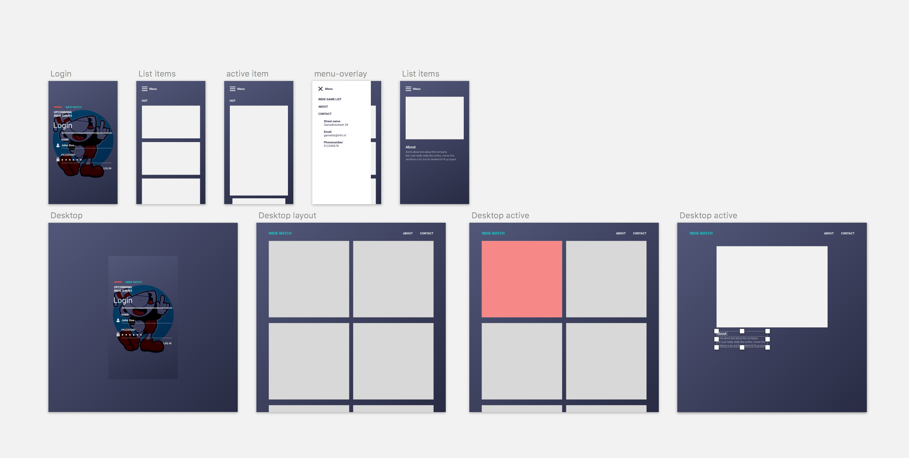

# CSSTR Process
`This` document is made for my procres in CSSTR class.
It will contain my scedule and the progress I've made in the couple of weeks for this class.

## Scedule
| Week 1        | Week 2|  Week 3  |
| ------------- |:-------------:| -----:|
| Research    | Code | Code |
| Design    | Research |
| Code | Code    |

## Design 

## Week 1
Onderzoek gedaan naar grid, sketch notes bijgehouden.
Een design gemaakt.

## Week 2.
Week 2 vooral gefocussed om alle alle componenten op de juiste plek neer te zetten.
En de stijling door te brengen.

## Week 3.
Gefocussed op de ux animaties om te zorgen dat de gebruiker goed kan zien waar hij/zij echter is op de pagina.

### Resources
* [Gridgarden](http://cssgridgarden.com/) Hier mee leer je beetje bij beetje over grid.
* [Debugging keyframes](https://css-tricks.com/debugging-css-keyframe-animations/)
* [Animation States](https://css-tricks.com/css-animation-tricks/)
* [Form Validation CSS](https://css-tricks.com/form-validation-ux-html-css/)
* [CSS Parenting](https://css-tricks.com/parent-selectors-in-css/)
* [Transform](https://css-tricks.com/almanac/properties/t/transform/)
* [Focus-within](https://developer.mozilla.org/en-US/docs/Web/CSS/:focus-within)

## Referenties:
Hierin zitten argumenten voor aanpassingen in de html.
* https://stackoverflow.com/questions/2906582/how-to-create-an-html-button-that-acts-like-a-link

[De Opdracht](https://senmetsu.github.io/cssttr/)
